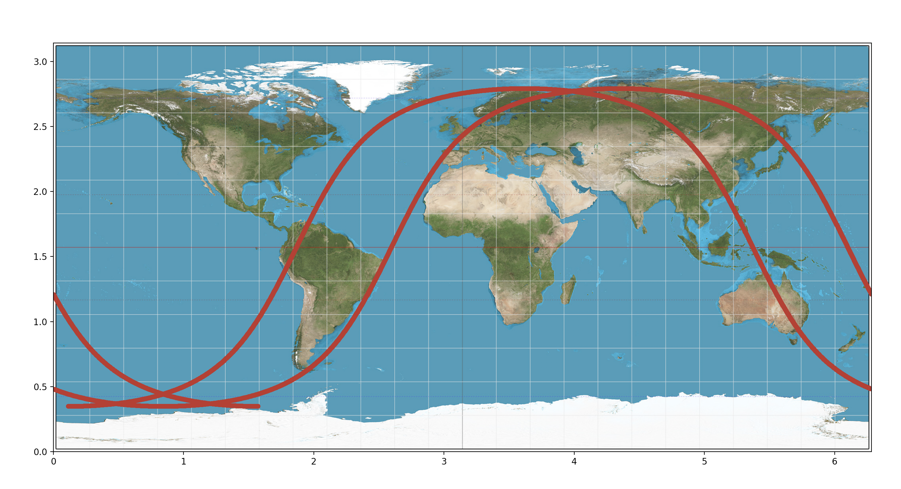

# SatChallenge (HackaTUM 2021)

Winning entry of the HackaTUM 2021 Sat-Challenge given by Rohde & Schwarz. You can find our final submission for the challenge on [Devpost](https://devpost.com/software/hamiltumian).


# Project Description
Rohde & Schwarz tasked the attending teams at this years [HackaTUM](https://hack.tum.de/) with developing a satellite constellation intended for air traffic communication. Several factors had to be taken into account, including the Doppler shift, guaranteeing full coverage of fixed geographic regions at all times, and the directionality of the planes' communication antennas. This project provides a working solution and some of the intermidiate simulation tools we used to solve the problem.

# Project Structure
In this repo are two visualisation tools:
1. 2D
- GroundTrack.py: script for plotting the GroundTracks of sattelites with adjustable height
- animation.py: script to create animations of the time evolution of a given sattelite distribution and the area that is covered by those sattelites
2. 3D
- The Scenes in the Scenes Folder contain examples on how to use the simulation.
- SatPosBinder.cs feeds the positions of all GameObjects tagged Satellite into the Coverage Compute Shader
- SatellitesOnRing.cs creates Satellite orbits with configurable radius and number of Satellites. The rotation speed is calculated automatically.
- fancyConeShader.shader calculates the effective communication cones from the satellites onto a mesh (the globe) and colors in the doppler shifted regions. The threshold for the acceptable doppler shift is adjustable. It requires a SatPosBinder.cs component on the same object to function.

# Installation
1. 2D
```console
    foo@bar:~$ git clone https://github.com/RiaRosenauer/SatChallenge.git
    foo@bar:~$ cd SatChallenge/2d
    foo@bar:~$ conda create --name HackaTUM21 --file requirements.yml
    foo@bar:~$ conda activate HackaTUM21
    foo@bar:~$ pip install -r requirements.txt   
```

2. 3D 

Open the project with Unity 2021.1.27f1 and import any missing dependencies using the package manager.


# Usage
1. 2D
- **GroundTrack.py**:

Starting in line 87 of the file, simply put in the parameters of the satellite track that you would like to see and run the python script. The output
should be something like this:

- **Animation.py**:

In lines 148-159 and 221-226, adjust the animation and sattelite parameters to your needs. Also outcomment and/or uncomment the functions that are highlighted as different modi according to your wishes.
The output is a mp4 file, looking similar too:


2. 3D
- Open a Sample Scene in the Scenes Folder and Play to test out the simulation.
